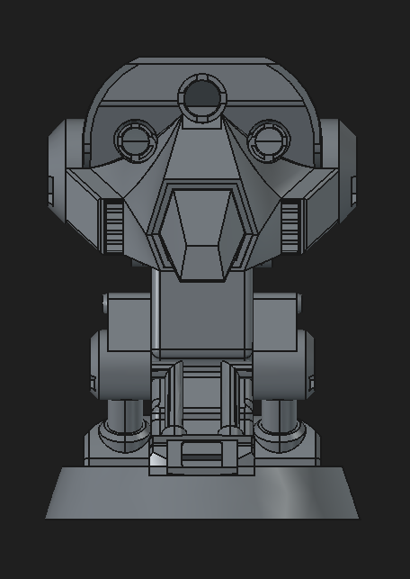

# Project-General-Kalani-V1

A talking and moving bust of an ST-series military strategic analysis and tactics droid serving the Confederacy of Independent Systems.

## Warning

* The neck joint is currently non-functional.

## Architecture Preview

```
User → Microphone → Raspberry Pi → Server → Response → Speaker
```

## Components

* Raspberry Pi 4 (4 GB)
* 3× RGB LED Module (7× NeoPixel WS2812)
* Adafruit I2S MEMS Microphone Breakout – SPH0645LM4H
* JBL Speaker
* LD2410C Human Presence Sensor (HLK-LD2410C)
* PCA9685 Servo Controller
* 2× Waveshare MG90S Micro Servos
* MG996R Servo
* External battery capable of powering the servos
* Dupont cables (10 cm, 20 cm, 30 cm, and 40 cm)

### Stores

* https://rpishop.cz
* https://www.drotik-elektro.sk

---

## Head

* All parts were printed on a Prusa Mini+.
* The parts were sanded using 120 → 240 → 320 → 600 grit sandpaper.
* Before using the 320 and 600 grit sandpaper, I applied a thin coat of Modulan 101 wood filler (purchased from Hornbach). It creates a smooth surface, hides the visible 3D printing layers, dries quickly, and does not chip off. Need to add little bit of water and mix it up.

### Filaments

* Prusament PETG Pigment White
* Buddy3D PLA White
* PolyTerra PLA White

### Stores

* https://www.prusa3d.com

* https://www.3djake.sk

* Printing all components took approximately three weeks. (It could have been faster—I wasn't printing continuously.)

* Approximately 1.5 spools of filament were used.

---

## Paints

* MASTON Plastic Primer
* MASTON Metallic Black
* MASTON Metallic Silver

### Store

* https://www.hornbach.sk

---

## Updates

Progress photos can be found in the `updates` folder.

---

## Project Preview

<p align="center">
  
</p>
